# Technical Blog Writing Skill

## When to Use

- Source code analysis / architecture deep dive
- Implementation walkthrough with `file:line` citations
- Technology comparison or design trade-off post
- Doc-driven research post (no source code in scope)

## Document Skeleton

```markdown
# [Topic] Deep Dive

Brief intro + why it matters.
> **Code Version**: Based on [project] `vX.Y.Z` (commit `abc1234`).

## 1. Introduction (problem + scope + navigation table)
## 2-N. Core Content (by data flow, not code structure)
## N+1. Design Decisions & Trade-offs
## N+2. Code Index (file, lines, responsibility)
## References
```

- §1 = problem + scope + navigation only — no implementation
- Each core section follows: concept → diagram → code → insight
- Navigation hints: `> ⏭️ First-time readers: skip to §X.`

---

## Core Principles

1. **Problem-first, progressive** — start with the problem; build concepts layer by layer; explain "why"
2. **Concept-before-use** — never use undefined terms; add §X.Y.1 concept sections; cross-ref with `⏭️`
3. **Big picture first** — unified visual overview before details; comparison diagram/table for 2+ approaches
4. **Balanced comparison** — analyze both sides; comparison tables; identify real differences vs. equivalences
5. **Design decisions** — state the problem, alternatives, and trade-offs for every non-obvious choice
6. **Concrete examples** — 1-2 per major section; show input → process → output with real data
7. **Terminology accuracy** — verify via source code or official docs; define on first use

---

## Research Strategy

| Source | When | Examples |
|--------|------|---------|
| Source code | Project-specific logic, defaults, file paths | Config params, implementation variants |
| Knowledge | Standard protocols, well-known algorithms | ES DSL, HTTP, B+ tree |
| Doc-driven | No source code; external systems | Official docs → vendor blogs → community |

Doc-driven rules: extract claim list → cite at claim location → reference-style links `[Label]: URL` → separate fact vs. inference → never fabricate numbers.

---

## Writing Guidelines

### Code Examples
- Every snippet needs `file_path:line_number`
- Explain what it does, not just show it
- Replace large blocks with diagram + key snippet

### Mermaid Styling Standard

All diagrams must use rich color styling. Monotone = rejected.

**Color Palette**

| Role | Fill | Stroke | Text |
|------|------|--------|------|
| Primary Actor | `#6C5CE7` | `#5A4BD1` | `#fff` |
| Core Component | `#0984E3` | `#0770C2` | `#fff` |
| Service / Hub | `#00B894` | `#009D7E` | `#fff` |
| Helper / Auxiliary | `#FDCB6E` | `#E0B050` | `#2D3436` |
| External / Remote | `#E17055` | `#C0392B` | `#fff` |
| Data Store | `#636E72` | `#2D3436` | `#fff` |
| Output / Sink | `#55EFC4` | `#00B894` | `#2D3436` |
| Light Accent | `#74B9FF` | `#0984E3` | `#2D3436` |

**graph / flowchart** — every node styled; subgraphs: named ID + emoji label + colored bg

```mermaid
graph TB
    subgraph local["🖥️ Local"]
        A["Component A"]
        B["Component B"]
    end
    subgraph remote["📱 Remote"]
        C["Client"]
    end
    A --> B --> C
    style A fill:#0984E3,stroke:#0770C2,color:#fff,stroke-width:2px
    style B fill:#00B894,stroke:#009D7E,color:#fff,stroke-width:2px
    style C fill:#E17055,stroke:#C0392B,color:#fff,stroke-width:2px
    style local fill:#DFE6E9,stroke:#636E72,stroke-width:2px,color:#2D3436
    style remote fill:#FAD7D4,stroke:#E17055,stroke-width:2px,color:#2D3436
```



**sequenceDiagram** — `box rgb()` per layer + emoji participants

```mermaid
sequenceDiagram
    box rgb(232,245,253) CLI Side
        participant CLI as 🔧 CLI
    end
    box rgb(220,247,235) Hub Side
        participant Hub as 🌐 Hub
    end
    CLI->>Hub: request
    Hub-->>CLI: response
```



Box colors: CLI `rgb(232,245,253)` · Hub `rgb(220,247,235)` · Web `rgb(255,235,238)` · Agent `rgb(237,231,246)` · User `rgb(255,243,224)`

**stateDiagram-v2** — `classDef` per category + `class` binding


**Rules**: step numbers for complex flows (`A -->|1. Do X| B`) · emoji in labels · no unstyled diagrams

### Callouts

- 💡 **Key Point** — critical insight
- ⚠️ **Gotcha** — common mistake or subtle trap
- 🤔 **Think About** — design reasoning or open question
- ⏭️ **Navigation** — cross-reference to another section

---

## Quality Gates

- **No fabricated data** — qualitative OK ("fast compression"); quantitative needs citation
- **DRY concepts** — same concept in 3+ places → one authoritative section, others reference it
- **Hybrid systems** — verify which component does what; trace actual data flow; don't assume

---

## Common Pitfalls

| Pitfall | Fix |
|---------|-----|
| Abrupt transitions | Connection sentences between sections |
| One-sided comparison | Comparison table, analyze both sides |
| Code without context | Explain role in the system |
| Too much source code | Diagram + key snippet |
| Undefined concepts | Concept section before use |
| Missing big picture | Unified visual overview first |
| Fabricated data | Qualitative language or cite source |
| Missing commit id | Always specify for external repos |
| Monotone diagrams | Full Mermaid styling standard |

---

## Large Documents (>500 lines)

Draft-first: `[topic]-DRAFT.md` → build → review → merge → delete draft.

---

## Checklist

- [ ] Sections flow with transitions; summary-detail pattern
- [ ] Concepts introduced before use; `⏭️` navigation hints
- [ ] Code examples have `file:line`; 1-2 concrete examples per section
- [ ] No fabricated numbers; terminology verified against source
- [ ] Code version / commit id specified
- [ ] All Mermaid diagrams fully styled (palette + emoji + backgrounds)
- [ ] Comparison tables for similar concepts

---

## Output

- Location: `docs/`, `ai_docs/`, or project folder
- Filename: `[topic-name].md`
- Language: match user preference
