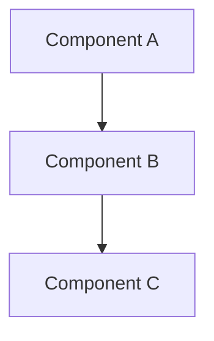
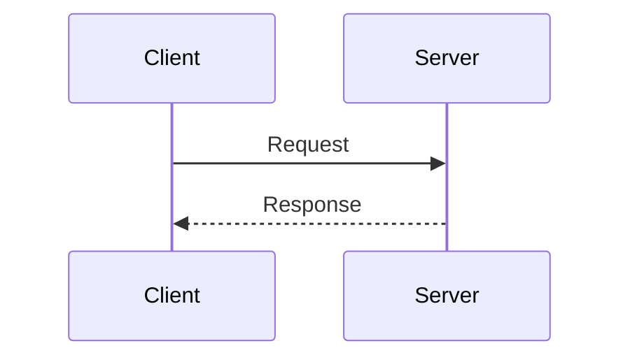
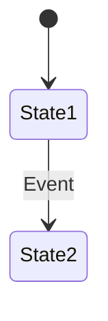

# Technical Design Document Skill

## Overview

Generate well-structured technical design documents including:
- Problem analysis and background
- Solution comparison and trade-offs
- Architecture design with diagrams
- Implementation specifications
- Risk assessment

## When to Use

- Designing a new feature or system
- Documenting architecture decisions
- Creating RFCs (Request for Comments)
- Planning refactoring or optimization work

## Usage

Provide:
- The problem or feature to design
- Any constraints or requirements
- Preferred output location (optional)

**Language**: Default is **English**. Use Chinese only if user explicitly requests it.

## Document Structure

### 1. Title and TL;DR

```markdown
# [Feature/System Name] Technical Design Document

## TL;DR
- 3-5 bullet points summarizing the document
- Key decisions and rationale
- Expected outcomes
```

### 2. Background

```markdown
## Background

### Current State
- Existing system/behavior
- Pain points and limitations

### Problem Statement
- Clear problem definition
- Impact and scope

### Goals and Non-Goals
**Goals:** What this design aims to achieve
**Non-Goals:** Explicitly out of scope items
```

### 3. Solution Analysis

```markdown
## Solution Analysis

### Option 1: [Name]
**Description:** Brief explanation
**Pros:** ...
**Cons:** ...

### Comparison Matrix
| Criteria | Option 1 | Option 2 |
|----------|----------|----------|
| Performance | High | Medium |
| Complexity | Low | High |

### Recommendation
**Selected: Option X**
Rationale: [Why this option was chosen]
```

### 4. Detailed Design

```markdown
## Detailed Design

### Architecture Overview
[Mermaid diagram]

### Component Design
- Responsibility
- Interface definition
- Dependencies

### Data Model
[Schema or data structure definitions]

### API Design
[API specifications if applicable]
```

### 5. Implementation and Risk

```markdown
## Implementation Plan
### Phase 1: [Name]
- Tasks and deliverables

### Migration Strategy
[If applicable]

## Risk Assessment
| Risk | Probability | Impact | Mitigation |
|------|-------------|--------|------------|
| Risk 1 | High/Med/Low | High/Med/Low | Strategy |
```

### 6. Testing and Monitoring (Optional)

Include when relevant:
- Testing strategy (unit, integration, performance)
- Monitoring metrics and alerts
- Logging requirements

### 7. References

- Related documents
- External resources

## Diagram Guidelines

Use Mermaid for all diagrams:

**Architecture:**


**Sequence:**


**State:**


## Quality Checklist

Before finalizing:
- [ ] Problem clearly defined
- [ ] Multiple options analyzed with trade-offs
- [ ] Decision rationale documented
- [ ] Diagrams illustrate key concepts
- [ ] Implementation steps are concrete
- [ ] Risks identified with mitigations

## Best Practices

**DO:**
- Start with the problem, not the solution
- Compare multiple options objectively
- Use diagrams to visualize architecture
- Document trade-offs explicitly

**DON'T:**
- Skip problem analysis
- Present only one option
- Write walls of text without structure
- Assume readers have full context

## Language Guidelines

**Default: English**

**When Chinese is Requested:**
- Use Chinese for prose content
- Keep code and technical terms in English

## Output Location

- Suggest project's `docs/` or `ai_docs/` directory
- Ask user if location is unclear