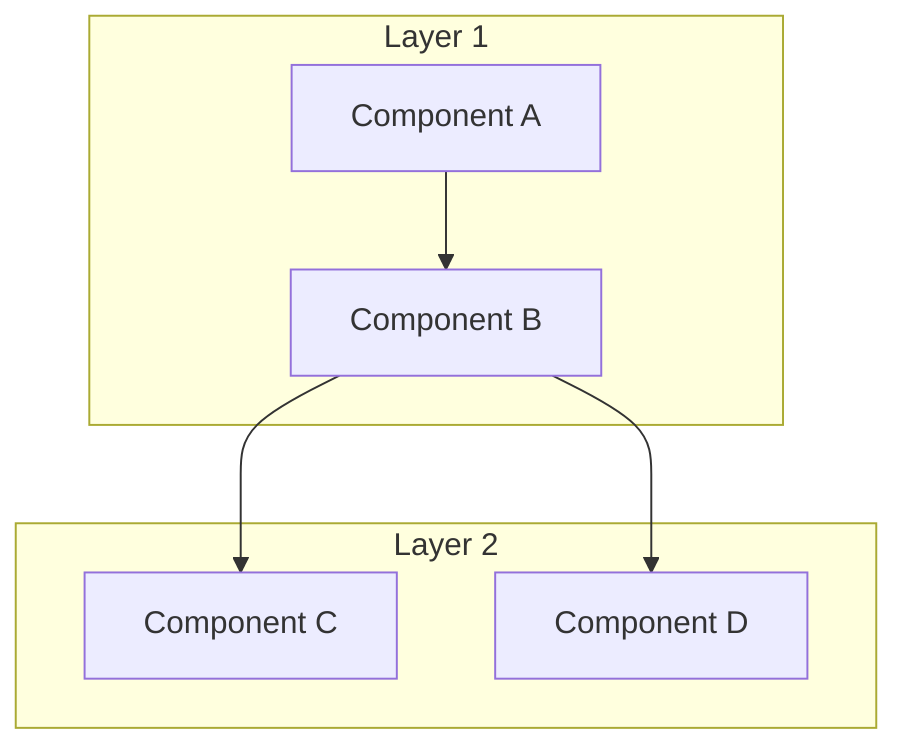
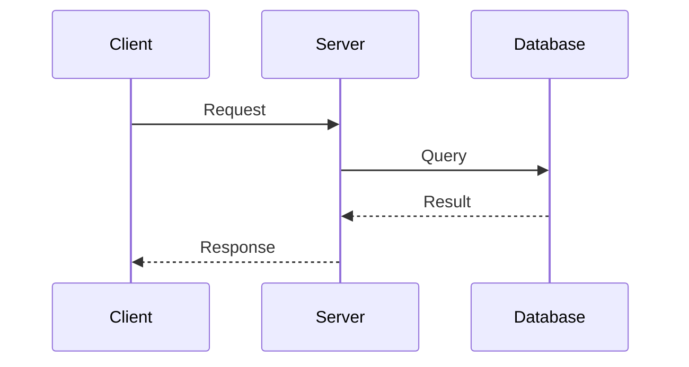
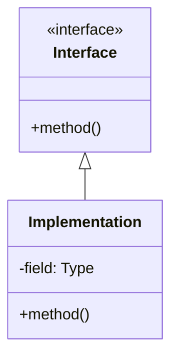
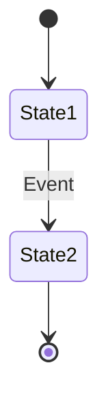

# Technical Design Document Skill

## Overview

This skill generates well-structured technical design documents that include:
1. Problem analysis and background
2. Solution comparison and trade-offs
3. Detailed architecture design with diagrams
4. Implementation specifications
5. Risk assessment and mitigation

## When to Use

- Designing a new feature or system
- Documenting architecture decisions
- Creating RFCs (Request for Comments)
- Planning refactoring or optimization work
- Recording technical solutions for team review

## Usage

Invoke this skill when you need to create a technical design document. Provide:
- The problem or feature to design
- Any constraints or requirements
- Preferred output location (optional)

**Language**: Default is **English**. Use Chinese only if user explicitly requests it (e.g., "generate in Chinese", "use Chinese", "write in Chinese").

## Document Structure

### 1. Title and Metadata

```markdown
# [Feature/System Name] Technical Design Document

| Field | Value |
|-------|-------|
| Author | [Name] |
| Status | Draft / In Review / Approved |
| Created | YYYY-MM-DD |
| Updated | YYYY-MM-DD |
```

### 2. Executive Summary (TL;DR)

- 3-5 bullet points summarizing the entire document
- Key decisions and their rationale
- Expected outcomes

### 3. Background and Problem Statement

```markdown
## Background

### Current State
- Describe the existing system/behavior
- Pain points and limitations

### Problem Statement
- Clear definition of the problem
- Impact and scope
- Why it needs to be solved now

### Goals and Non-Goals

**Goals:**
- What this design aims to achieve
- Success criteria

**Non-Goals:**
- Explicitly out of scope items
- Future considerations
```

### 4. Solution Analysis

```markdown
## Solution Analysis

### Option 1: [Name]

**Description:** Brief explanation

**Pros:**
- Advantage 1
- Advantage 2

**Cons:**
- Disadvantage 1
- Disadvantage 2

**Complexity:** Low / Medium / High

### Option 2: [Name]
...

### Comparison Matrix

| Criteria | Option 1 | Option 2 | Option 3 |
|----------|----------|----------|----------|
| Performance | High | Medium | Low |
| Complexity | Low | Medium | High |
| Maintainability | Good | Good | Poor |
| Risk | Low | Medium | High |

### Recommendation

**Selected: Option X**

Rationale: [Why this option was chosen]
```

### 5. Detailed Design

```markdown
## Detailed Design

### Architecture Overview

[Include Mermaid diagram]

### Component Design

#### Component A
- Responsibility
- Interface definition
- Dependencies

#### Component B
...

### Data Model

[Include schema or data structure definitions]

### API Design

[Include API specifications if applicable]

### Sequence Diagrams

[Show key workflows with Mermaid]
```

### 6. Implementation Plan

```markdown
## Implementation Plan

### Phase 1: [Name]
- Tasks
- Dependencies
- Deliverables

### Phase 2: [Name]
...

### Migration Strategy

[If applicable, describe how to migrate from old to new]
```

### 7. Risk Assessment

```markdown
## Risk Assessment

| Risk | Probability | Impact | Mitigation |
|------|-------------|--------|------------|
| Risk 1 | High/Med/Low | High/Med/Low | Strategy |
| Risk 2 | ... | ... | ... |
```

### 8. Testing Strategy

```markdown
## Testing Strategy

### Unit Tests
- Coverage requirements
- Key test cases

### Integration Tests
- Test scenarios
- Environment requirements

### Performance Tests
- Benchmarks
- Acceptance criteria
```

### 9. Monitoring and Observability

```markdown
## Monitoring

### Metrics
- Key metrics to track
- Alert thresholds

### Logging
- Log levels and content
- Debugging support

### Dashboards
- Required dashboards
```

### 10. References and Appendix

```markdown
## References

- Related documents
- External resources

## Appendix

### Glossary
- Term definitions

### Detailed Calculations
- Any complex calculations or analysis
```

## Diagram Guidelines

### Use Mermaid for All Diagrams

#### Architecture Diagram


#### Sequence Diagram


#### Class Diagram


#### State Diagram


## Quality Checklist

Before finalizing the document, verify:

### Completeness
- [ ] Problem is clearly defined
- [ ] All viable options are analyzed
- [ ] Decision rationale is documented
- [ ] Implementation details are sufficient
- [ ] Risks are identified with mitigations

### Clarity
- [ ] No ambiguous terms without definition
- [ ] Diagrams illustrate key concepts
- [ ] Code examples are clear and correct
- [ ] Assumptions are explicitly stated

### Actionability
- [ ] Implementation steps are concrete
- [ ] Success criteria are measurable
- [ ] Testing strategy is defined
- [ ] Monitoring plan is included

## Best Practices

### DO:
- Start with the problem, not the solution
- Compare multiple options objectively
- Use diagrams to visualize architecture
- Include concrete code examples
- Document trade-offs explicitly
- Define success metrics
- Consider failure modes

### DON'T:
- Skip the problem analysis
- Present only one option without alternatives
- Write walls of text without structure
- Ignore edge cases and error handling
- Assume readers have full context
- Leave ambiguous implementation details

## Language Guidelines

### Default: English

Write all documents in English unless explicitly requested otherwise.

### When Chinese is Requested

If user says "use Chinese", "write in Chinese", "generate in Chinese", or similar:
- Use Chinese for all prose content
- Keep code, variable names, and technical terms in English
- Use Chinese for diagram labels where appropriate

## Output Location

### Default Behavior
- Ask user where to save the document
- Suggest project's `docs/` or `ai_docs/` directory

### Common Locations
- `docs/design/` - For project documentation
- `ai_docs/` - For AI-generated documentation
- RFC directory if project has one

## Example Invocations

### Example 1: New Feature Design

**User:** Design a caching layer for our API

**Skill Response:**
1. Ask clarifying questions (scale, latency requirements, existing infra)
2. Generate document with:
   - Cache strategy options (Redis, Memcached, in-memory)
   - Comparison matrix
   - Recommended solution with architecture diagram
   - Cache invalidation strategy
   - Implementation plan

### Example 2: System Optimization

**User:** Document the two-phase query optimization design

**Skill Response:**
1. Document current performance issues
2. Explain two-phase approach
3. Show before/after architecture
4. Include performance analysis
5. Detail implementation steps

### Example 3: Chinese Document

**User:** Help me write a technical design doc for the new auth system, use Chinese

**Skill Response:**
1. Generate document in Chinese
2. Keep technical terms and code in English
3. Follow same structure and quality standards

## Template Quick Reference

```markdown
# [Title] Technical Design Document

## TL;DR
- Key point 1
- Key point 2
- Key point 3

## Background
### Current State
### Problem Statement
### Goals and Non-Goals

## Solution Analysis
### Option 1
### Option 2
### Comparison
### Recommendation

## Detailed Design
### Architecture
### Components
### Data Model
### APIs

## Implementation Plan
### Phases
### Migration

## Risk Assessment

## Testing Strategy

## Monitoring

## References
```