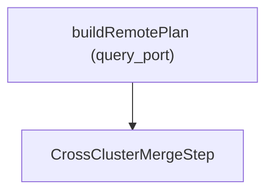

# Technical Implementation Doc Skill

## When to use
- The user asks for an implementation doc, technical deep dive, architecture/design write-up, or a user guide describing how a system works.

## Confirm up front
- **Audience**: user / developer / mixed.
- **Scope**: which features or subsystems to cover.
- **Output location** and **language**.
- **Diagrams**: include Mermaid for multi-step flows unless the user says not to.

## Audience rules

### User-facing docs
- **No code locations** or internal class names unless explicitly requested.
- Focus on configuration, behavior, and operational steps.
- Use **direct clickable links** (raw URLs). Do not hide references behind footnotes.
- **Avoid boilerplate**: no “this document describes…”, no “version info”, no filler headings.

### Developer-facing docs
- Include **code paths and line numbers**.
- Add a **Code Index**: each entry must explain what the code is responsible for.
- Call out **constraints, failure modes, and trade-offs**.

## Structure rules
- Headings must be **meaningful** (no parenthetical fluff like “(quick copy)” or “(notes)”).
- Prefer **numbered sections** for complex systems.
- Keep intro minimal; skip generic explanations.

## Mermaid rules (avoid parse errors)
- Keep node labels simple; **avoid parentheses** and heavy punctuation in labels.
- If a label must contain special characters, **wrap it in quotes**.
- Avoid line breaks inside labels.
- Use simple node IDs (A, B, C…).

**Safe example:**

## Workflow
1) Identify audience and constraints.
2) Scan existing docs; consolidate instead of duplicating.
3) Verify claims against source code or authoritative docs.
4) Draft core flow first (request path → execution → merge → output).
5) Add Mermaid diagrams for key flows.
6) Add constraints/unsupported features section.
7) Add Code Index with descriptions (developer docs only).
8) Final pass to remove boilerplate and meaningless headings.

## Output checklist
- Audience-appropriate detail level.
- No redundant intro/version sections unless requested.
- Mermaid diagrams render without parse errors.
- Code Index entries explain their purpose (developer docs only).
- Links are clickable in user docs.
